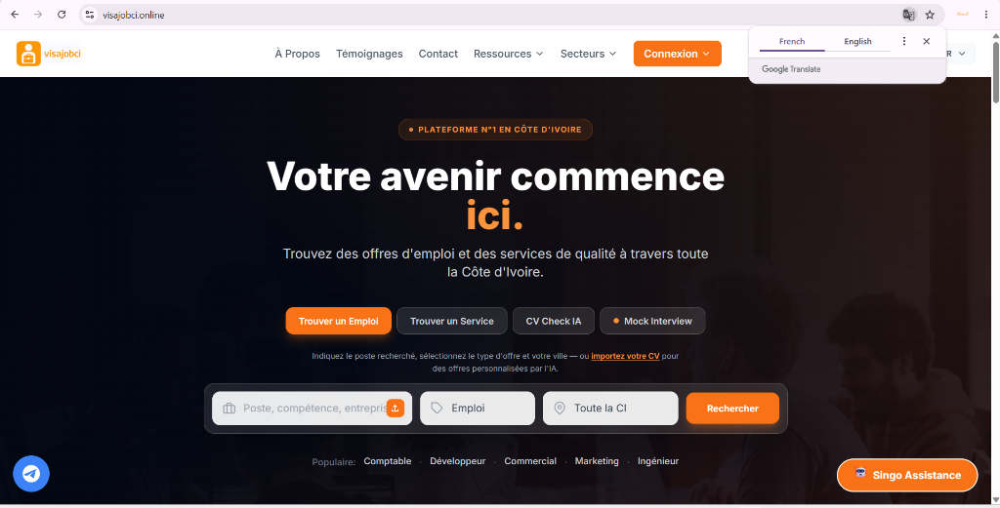
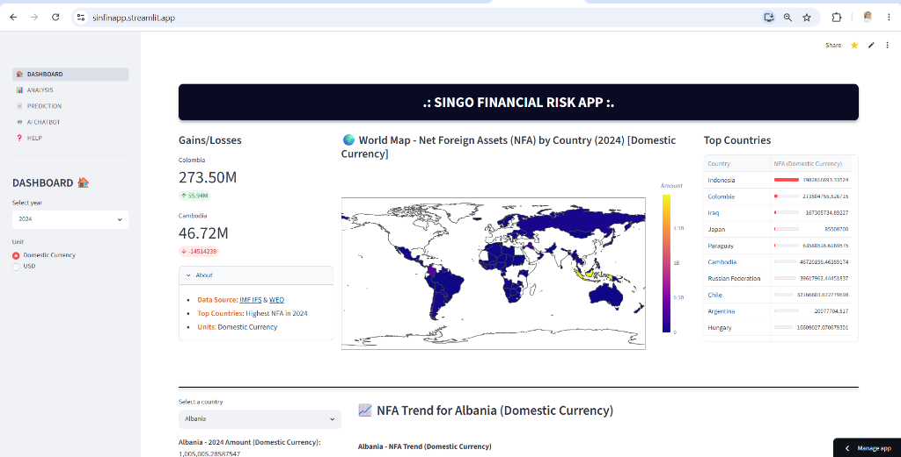
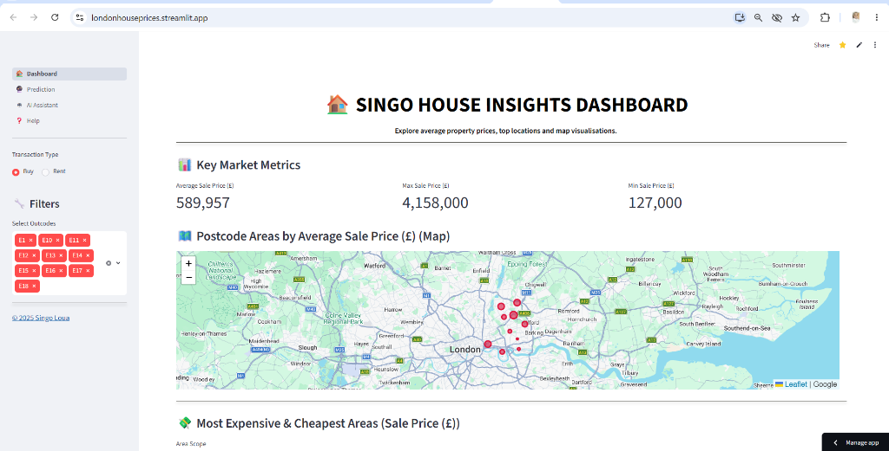
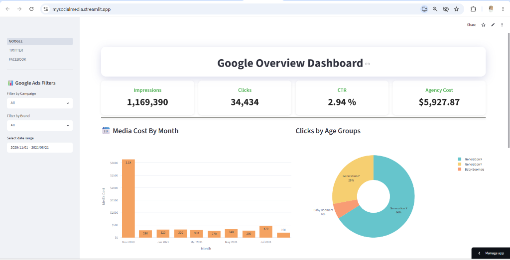
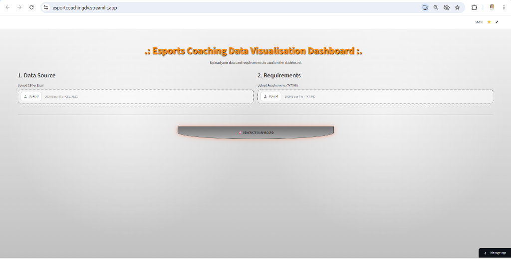
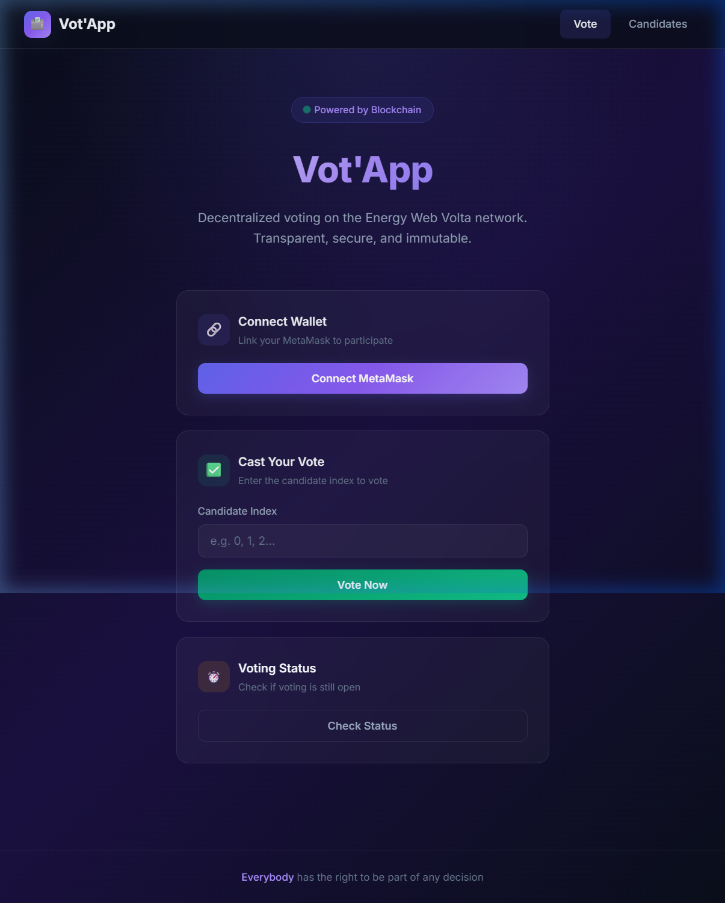

# Bonjour, I'm Singo Loua 👋
### Founder of VisaJobCI | Applied Data Scientist | Computer Engineer | Co-Founder of CypruServices.com

I am an **Applied Data Scientist** and **Computer Engineer (MSc)** passionate about developing intelligence-driven applications, data-intensive systems, and decentralized applications (dApps). I specialize in bridging the gap between advanced machine learning models, visual analytics, and production-ready software systems.

---

### 🚀 Entrepreneurship & Platforms

* **[VisaJobCI](https://visajobci.online)**
  * Founder of the #1 employment and job search platform in Côte d'Ivoire, featuring AI-powered CV checking and mock interview preparation.
  * 🌐 **[Visit visajobci.online](https://visajobci.online)**
  

  

* **[CypruServices](https://cypruservices.com)**
  * Co-Founder of a client-focused services agency.
  * 🌐 **[Visit cypruservices.com](https://cypruservices.com)**

---

### 📊 Live Streamlit Dashboards

* **[Singo Financial Risk App](https://sinfinapp.streamlit.app)**
  * An advanced financial analytics dashboard featuring NFA (Net Foreign Assets) tracking by country, global asset mapping, predictive trends analysis, and an integrated AI chatbot.
  * 🔗 **[Try the Live Dashboard](https://sinfinapp.streamlit.app)**

  

* **[Singo House Insights Dashboard](https://londonhouseprices.streamlit.app)**
  * An interactive property insights platform visualizing average London property prices, top locations, and map-based distributions.
  * 🔗 **[Try the Live Dashboard](https://londonhouseprices.streamlit.app)**

  

* **[Google Ads Overview Dashboard](https://mysocialmedia.streamlit.app)**
  * A comprehensive marketing analytics dashboard tracking impressions, clicks, CTR, and costs across Google, Twitter, and Facebook ads campaigns.
  * 🔗 **[Try the Live Dashboard](https://mysocialmedia.streamlit.app)**

  

* **[Esports Coaching Data Visualisation](https://esportcoachingdv.streamlit.app)**
  * A custom analytics tool for esports coaching. Users can upload data sources and dynamically generate customized data visualization dashboards.
  * 🔗 **[Try the Live Dashboard](https://esportcoachingdv.streamlit.app)**

  

---

### 🔗 Web3 Projects

* **[Vot'App — Decentralized Voting System](https://github.com/singoloua/BLOCK-CHAIN-BASED-VOTING-SYSTEM_2023)**
  * A premium, Web3 voting application built on the Volta testnet. Allows secure voter verification and transparent, real-time results directly on the blockchain.
  * 🌐 **[Try the Live Web App](https://singoloua.github.io/BLOCK-CHAIN-BASED-VOTING-SYSTEM_2023/)**

  

* **[MailBox 2023](https://github.com/singoloua/MailBox_2023)**
  * A secure messaging system leveraging modern web standards.

* **[BLOCKCHAIN-TECHNOLOGY 2023](https://github.com/singoloua/BLOCKCHAIN-TECHNOLOGY_2023)**
  * Hardhat-based blockchain demo highlighting smart contracts and solving banking challenges.
  * 📺 **[Watch the YouTube Video Tutorial](https://youtu.be/1FTCXYVfUDo?si=Ss41WVu7MqyZoUwe)**

---

### 🛠️ Technical Skills

* **Data Science & ML**: Python (TensorFlow, PyTorch, Scikit-Learn), R, NLP, Data Analysis, SQL, Streamlit
* **Web3 & Blockchain**: Solidity, Hardhat, Ethers.js, MetaMask Integration, Smart Contract Auditing
* **Web Development**: Node.js, Express, JavaScript, CSS3, HTML5
* **Tools & DevOps**: Git, GitHub Pages, NPM, Linux

---

### 🌐 Let's Connect!

* 💼 **LinkedIn**: [linkedin.com/in/singo-loua-3a2931130](https://www.linkedin.com/in/singo-loua-3a2931130/)
* 🎙️ **Podcasting & Blogging**: Passionate about teaching, sharing tech insights, and speaking.
* 🚀 **Business**: Co-Founder at [CypruServices.com](https://cypruservices.com)
